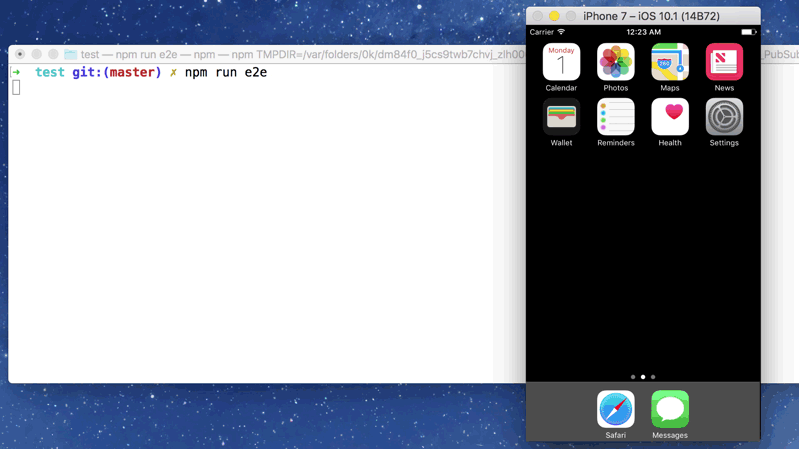

# RN Detox测试(一)-安卓环境搭建

## Detox 能做些什么

[官网](https://github.com/wix/Detox)

用于移动应用程序的灰盒端到端（E2E）测试和自动化测试工具。



## 怎么在RN引用

> 本篇主要针对安卓端进行测试，ios端请参考[链接](https://github.com/wix/Detox/blob/master/docs/Introduction.GettingStarted.md)

以下步骤的前提是你已经拥有一个RN项目并能顺利启动

### 安装detox命令行工具

```
npm install -g detox-cli
```

### 在项目里引入detox

```
npm install detox --save-dev
```

### 在安卓环境里引入detox

在你的根目录的`build.gradle`里注册google()和detox作为所有项目中的存储库的查找点

```
// Note: add the 'allproject' section if it doesn't exist
allprojects {
    repositories {
        // ...
        google()
        maven {
            // All of Detox' artifacts are provided via the npm module
            url "$rootDir/../node_modules/detox/Detox-android"
        }
    }
}
```

在你app目录的gradle文件`app/build.gradle` 添加如下 `dependencies` 

```
dependencies {
	  // ...
    androidTestImplementation('com.wix:detox:+') { transitive = true } 
    androidTestImplementation 'junit:junit:4.12'
}
```

在你app目录的gradle文件`app/build.gradle` 添加如下`defaultConfig`

```
android {
  // ...
  
  defaultConfig {
      // ...
      testBuildType System.getProperty('testBuildType', 'debug')  // This will later be used to control the test apk build type
      testInstrumentationRunner 'androidx.test.runner.AndroidJUnitRunner'
  }
}
```

> 确保 `minSdkVersion` 至少是18版本的

### 添加Kotlin

在`android/build.gradle`添加kotlin依赖

```
buildscript {
    // ...
    ext.kotlinVersion = '1.3.0'

    dependencies {
        // ...
        classpath "org.jetbrains.kotlin:kotlin-gradle-plugin:$kotlinVersion"
    }
}
```

### 创建安卓测试文件

创建`android/app/src/androidTest/java/com/[your.package]/DetoxTest.java`文件 添加如下内容

```java
// Replace this with your app's package
package com.example;

import com.wix.detox.Detox;

import org.junit.Rule;
import org.junit.Test;
import org.junit.runner.RunWith;

import androidx.test.ext.junit.runners.AndroidJUnit4;
import androidx.test.filters.LargeTest;
import androidx.test.rule.ActivityTestRule;

@RunWith(AndroidJUnit4.class)
@LargeTest
public class DetoxTest {

    @Rule
    // Replace 'MainActivity' with the value of android:name entry in 
    // <activity> in AndroidManifest.xml
    public ActivityTestRule<MainActivity> mActivityRule = new ActivityTestRule<>(MainActivity.class, false, false);

    @Test
    public void runDetoxTests() {
        Detox.runTests(mActivityRule);
    }
}
```

### 添加detox配置到package.json文件

```json
"detox": {
  "configurations": {
    "android.att.debug": {
        "binaryPath": "android/app/build/outputs/apk/debug/app-debug.apk",
        "build": "cd android && ./gradlew assembleDebug assembleAndroidTest -DtestBuildType=debug && cd ..",
        "type": "android.attached",
        "device": {
          "adbName": "PFGGK19114000004"
        }
      },
      "android.emu.release": {
        "binaryPath": "android/app/build/outputs/apk/release/app-release.apk",
        "build": "cd android && ./gradlew assembleRelease assembleAndroidTest -DtestBuildType=release && cd ..",
        "type": "android.emulator",
        "device": {
          "avdName": "Nexus_5X_API_26"
        }
      }
  }
}
```

其中`type`是启动的模拟器或者连接的外接设备，外接设备名可以使用`adb devices`命令查看。具体的详细配置请看[链接](https://github.com/wix/Detox/blob/master/docs/APIRef.Configuration.md)

## 创建第一个测试文件

### 选择一个测试运行器

官方推荐[Jest](http://jestjs.io/)和[Mocha](https://mochajs.org/)，因为RN自带的jest，我们选择jest

```
npm install jest --save-dev
```

### 使用`detox init`初始化框架

```
detox init -r jest
```

> `detox init`做了如下几个事情:
>
> + 在项目根目录创建了`/e2e`文件夹
> + 在e2e文件夹下创建[config.json](https://github.com/wix/Detox/blob/master/examples/demo-react-native-jest/e2e/config.json)文件
> + 在e2e文件夹下创建[init.js](https://github.com/wix/Detox/blob/master/examples/demo-react-native-jest/e2e/init.js)文件
> + 在e2e文件夹下创建[firstTest.spec.js](https://github.com/wix/Detox/blob/master/examples/demo-react-native/e2e/example.spec.js)文件

## 跑起来

### 编译

```
detox build
```

### 最后运行测试🎉

```
detox test -c android.att.debug
```
