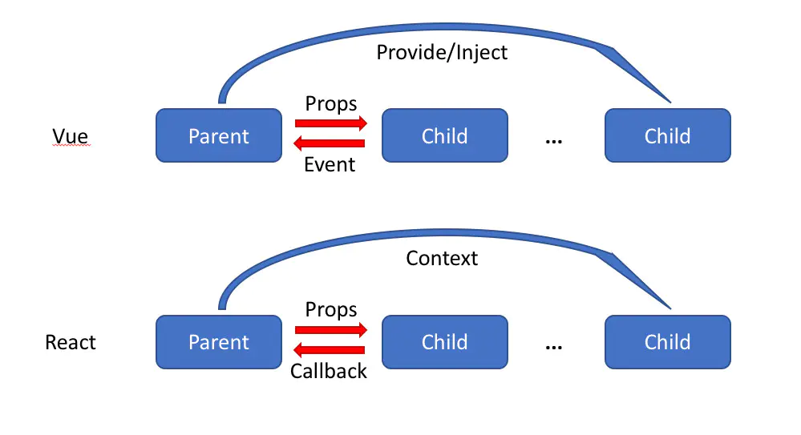

# React 和 Vue的异同

## 不同点
### 概念
+ react是一个库
+ vue是一个框架
### 模板 vs jsx
+ vue使用模板语法，你必须掌握很多指令写法
+ react使用jsx，写法通俗易懂
### 状态管理 vs 对象属性
+ react 使用 setState 方法管理组件的状态，开发人员必须使用setState方法修改数据才能触发视图更新
+ vue 对 定义的data进行数据劫持，通过get和set来改变组件的状态，当直接修改数据就会触发视图更新
### 组件通信方式

+ vue的高阶组件使用provide/inject传递数据，对于层级比较浅的可以用props和event（@emit）传递
+ react的高阶组件使用context共享数据，层级比较浅的可以用props和callback函数来传递
### 生命周期
+ react

+ vue

### 渲染
+ react
当某个组件的状态发生变化时，会以该组件为跟渲染整棵组件子树，为了避免不必要的渲染，要尽可能在可以使用的组件使用上pureComponent，或者手动实现shouldComponentUpdate方法。Hooks可以使用React.memo
+ vue
vue 基于它对数据的劫持可以清楚知道什么组件依赖数据，应该渲染什么组件
## 相同点
### virtualDom
react和vue都有virtualDom的概念，因为改变JavaScript对象远远比直接改变真实dom消耗的小，react和vue都需要做节点的渲染，diff比对等都基于virtualDom。

## 其他参考
+ [Vue 和 React 的优点分别是什么？](https://www.zhihu.com/question/301860721/answer/724759264)
